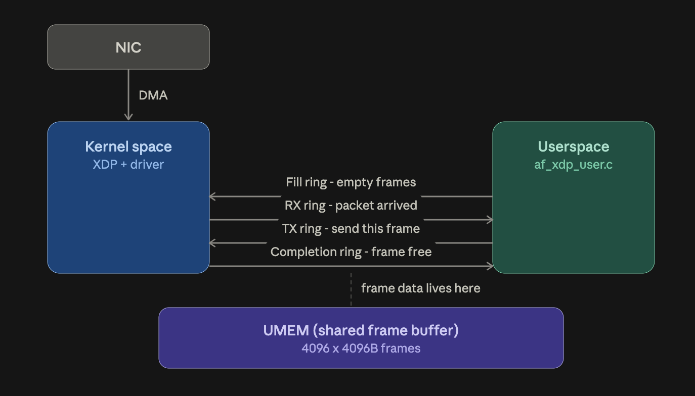
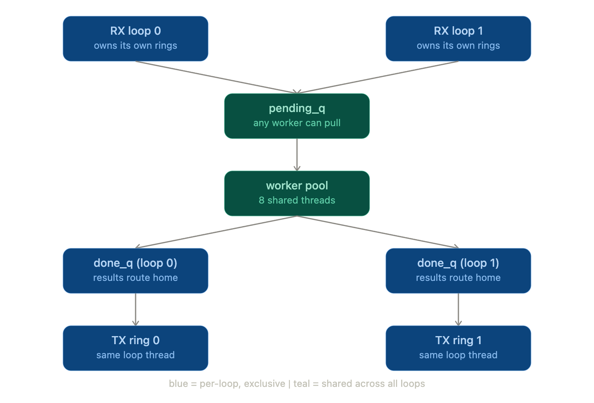

can i run dig on mac?
Yes — `dig` comes preinstalled on macOS as part of the BIND utilities. You can just open Terminal and run it directly, no extra installation needed:

```bash
dig example.com
```

A few useful variants:
- `dig example.com +short` — just the IP, no verbose output
- `dig example.com MX` — mail server records
- `dig example.com NS` — nameservers
- `dig -x 8.8.8.8` — reverse lookup (IP to hostname)
- `dig example.com ANY` — all record types (many DNS servers no longer respond fully to this)

If for some reason it's missing (rare, but possible on a minimal/stripped-down setup), you can get it via Homebrew: `brew install bind`.


what are different standard ports used for dns query?
DNS mainly uses one standard port, but there are a few variants depending on transport and context:

- **Port 53 (UDP)** — the default for standard DNS queries. Most lookups (like what `dig` sends) use this. UDP is preferred for speed since most responses are small.
- **Port 53 (TCP)** — used as a fallback when the response is too large for a single UDP packet (over 512 bytes for classic DNS, or larger with EDNS0), and also used for zone transfers (`AXFR`/`IXFR`) between DNS servers, which need TCP's reliability.
- **Port 853** — used for **DNS over TLS (DoT)**, which encrypts DNS queries.
- **Port 443** — used for **DNS over HTTPS (DoH)**, since it rides over standard HTTPS traffic (and helps it blend in / avoid blocking).
- **Port 5353** — used for **mDNS (multicast DNS)**, for local network name resolution (like `.local` hostnames), not general internet DNS.
- **Port 953** — used by `rndc` (BIND's remote name daemon control), not for queries themselves but for administering a DNS server.

For everyday troubleshooting with `dig`, you'll almost always be dealing with **port 53**. You can even specify it explicitly:

```bash
dig example.com -p 53
```

That's mainly useful if you're querying a DNS server on a non-standard port.

How do we check if a query is a dns query or not, what other type of query are on the network
You'd typically identify DNS queries by inspecting packet headers — port number and protocol are the quickest signals, but the actual packet structure confirms it. Here's how to check, and what else shares the network:

**Identifying a DNS query**

- **Port/protocol check**: Traffic on UDP/TCP port 53 (or 853 for DoT, 443 for DoH) is the first clue.
- **Packet inspection**: DNS has a distinct header format — a 12-byte header with fields like transaction ID, flags (QR bit distinguishes query vs response), question count, etc. Tools like Wireshark parse and label this automatically as "DNS" in the protocol column.
- **With `tcpdump`**:
  ```bash
  sudo tcpdump -i any port 53
  ```
  This filters to just DNS traffic by port.
- **With Wireshark**: use filter `dns` — it identifies packets by parsing the actual payload structure, not just the port, so it catches DNS-like traffic even on unusual ports.

**Other common query/traffic types on a network**

- **HTTP/HTTPS** (ports 80/443) — web requests
- **ARP** — resolves IP to MAC address on local network (no port, it's a different layer/protocol entirely)
- **DHCP** (ports 67/68) — IP address assignment queries
- **NTP** (port 123) — time sync queries
- **ICMP** — ping/traceroute (echo requests), not port-based
- **SNMP** (port 161) — network device monitoring queries
- **mDNS/SSDP** (ports 5353/1900) — local device/service discovery
- **TLS handshakes** (port 443, but distinct from HTTP payload) — SNI field is often visible even when encrypted

If you're trying to filter/classify mixed traffic, Wireshark's protocol-detection (based on payload signatures, not just port) is the most reliable approach — port-based filtering alone can misclassify traffic running on nonstandard ports.


What is an Nic and its drive what is is role
A **NIC (Network Interface Card)** is the hardware component that connects a device to a network — physically (Ethernet) or wirelessly (Wi-Fi). It handles the actual sending and receiving of data over the network medium.

**Role of a NIC:**
- Provides a unique **MAC address** (hardware identifier) for the device on the local network.
- Converts data from the computer into electrical, optical, or radio signals to transmit over the network, and does the reverse for incoming data.
- Handles low-level framing — packaging data into Ethernet frames (or Wi-Fi frames) for transmission.
- Performs error checking (like CRC checks) on incoming frames.
- Can offload some processing (checksums, segmentation) from the CPU — many modern NICs do this to reduce load on the main processor.

**What the NIC driver does:**

The driver is the software layer that lets the operating system talk to the NIC hardware. Without it, the OS has no way to control the card.

- **Translates OS network requests into hardware-specific commands** the NIC understands (and vice versa for incoming data).
- **Manages the hardware's registers, interrupts, and buffers** — e.g., handling when a packet arrives (via interrupts) and moving data between the NIC's memory and system memory.
- **Exposes a standard interface** to the OS networking stack, so upper layers (TCP/IP stack, sockets, etc.) don't need to know the specifics of the physical card — you could swap out an Intel NIC for a Realtek one and the OS-level networking still works the same way, because the driver handles the hardware differences underneath.
- **Configures NIC features** — like enabling offloading (checksum, TCP segmentation offload), setting speed/duplex, or managing power states.

**Quick analogy**: the NIC is like a mail carrier's physical truck and hands — it does the actual delivery. The driver is like the dispatcher who knows how to instruct that specific carrier ("use this route, pick up here, drop off there") so the rest of the company (the OS) doesn't need to know the carrier's quirks.

If you're troubleshooting a NIC issue, `ifconfig`/`ip a` (Linux/Mac) or Device Manager (Windows) will show you the interface and its driver status.

what is XDP, what is AF_XDP, what is it's purpose?
**XDP (eXpress Data Path)** is a high-performance packet processing framework built into the Linux kernel. It lets you run a custom eBPF program at the earliest possible point in the network stack — right at the NIC driver level, before the kernel allocates a full `sk_buff` (socket buffer) for the packet.

**Why it's fast:**
Normally, a packet goes: NIC → driver → kernel allocates sk_buff → protocol stack (IP/TCP/UDP parsing) → routing → socket → userspace. That's a lot of overhead per packet. XDP hooks in right after the NIC hands off the packet to the driver, before most of that machinery kicks in, so decisions get made with far less per-packet cost.

**What you can do with an XDP program:**
An XDP eBPF program returns one of a few verdicts per packet:
- `XDP_DROP` — drop it immediately (great for DDoS mitigation/filtering at line rate)
- `XDP_PASS` — let it continue up the normal kernel stack
- `XDP_TX` — bounce it back out the same interface (fast packet reflection, e.g., load balancing)
- `XDP_REDIRECT` — send it to another interface or into an `AF_XDP` socket
- `XDP_ABORTED` — drop + trigger a trace event (error case)

Common uses: DDoS protection, load balancing (this is how Facebook's Katran works), firewalling, and packet monitoring — all at very high throughput because you're avoiding most of the kernel's per-packet overhead.

---

**AF_XDP** is a special socket address family (like `AF_INET` or `AF_PACKET`) that lets you redirect raw packets from an XDP program **straight into userspace**, bypassing the kernel network stack almost entirely.

**How it works:**
- An XDP program in the kernel decides a packet should go to userspace (via `XDP_REDIRECT` into an XDP socket).
- Instead of copying the packet through the full stack, AF_XDP uses **shared memory rings** (UMEM — a region of memory mapped between kernel and userspace) so the packet data can be handed off with minimal or zero copying.
- Userspace application reads/writes packets directly from these rings.

**Purpose:**
AF_XDP exists for applications that need extremely high packet throughput with low latency but still want to use standard Linux — things like:
- Custom userspace networking stacks
- High-frequency trading systems (relevant to you, given your quant-finance side — this is genuinely used in low-latency trading infra)
- Software routers/switches
- DPDK-like use cases, but integrated into the kernel ecosystem (rather than needing to fully bypass the kernel like DPDK does)

**AF_XDP vs DPDK**, since they solve similar problems:
- DPDK fully bypasses the kernel, taking exclusive control of the NIC — max performance, but you lose the kernel's driver ecosystem and networking tools.
- AF_XDP works *with* the kernel (via the NIC driver), so you keep using the same driver, and the kernel can still handle some traffic normally while specific flows get fast-pathed to userspace. Slightly more overhead than DPDK, but much better integration and flexibility (you can route only certain packets to userspace and let the rest go through the normal stack).

Given the low-latency systems angle, this is the kind of thing that shows up in packet-processing pipelines for market data feeds — if that's the context, happy to go deeper into UMEM ring mechanics or a basic AF_XDP program structure.


Pasted file: architecture.md
This is what I'm working with, so the repo have the coding project and i'm learning what it does for interview prep.
That's a genuinely meaty project to study — good interview material since it touches kernel/userspace boundaries, lock-free-ish design, DNS security, and systems tradeoffs (which fits well with your CP + quant-finance + systems background).

Since you're prepping for interviews rather than just reading docs, it'd help to know what angle you want to drill into first.
Sounds good — go ahead and ask whenever something's unclear, whether it's a specific function, a design decision (like why they copy packets out of UMEM instead of holding the frame), or a broader concept like eBPF verifier rules or ring buffer mechanics. I've got the full architecture and file breakdown from what you shared, so just point me at whatever's confusing.


what is xdp, af_xdp, What is it's purpose, how does it work?
Good question to nail cold for an interview — let's tie it directly to how it's used in the repo you're studying.

## XDP (eXpress Data Path)

XDP is a Linux kernel hook that runs a small eBPF program at the earliest possible point a packet is seen — right in the NIC driver, before the kernel builds an `sk_buff` (its normal per-packet metadata structure) or runs it through the IP/UDP/TCP stack.

**Why it's fast:** the usual path is NIC → driver → allocate sk_buff → IP layer → transport layer → socket → userspace, with memory allocation and multiple layers of processing per packet. XDP intercepts before almost all of that, so a verdict can be made in nanoseconds instead of microseconds.

**What an XDP program returns**, per packet:
- `XDP_PASS` — let it continue up the normal stack
- `XDP_DROP` — discard immediately
- `XDP_TX` — bounce back out the same NIC
- `XDP_REDIRECT` — send to another interface or into an AF_XDP socket
- `XDP_ABORTED` — drop + trace event (error path)

**In your repo**, `af_xdp_kern.c` is exactly this — an XDP program attached to the NIC. It classifies each packet:
1. Is it IPv4? Not fragmented? UDP? Destined for port 53? Does it have a full 12-byte DNS header? Is it a query (not a response)? Exactly one question?
2. If yes to all → `bpf_redirect_map(&xsks_map, qidx, XDP_PASS)` — redirect into the AF_XDP socket bound to that RX queue.
3. If no to any → falls through to `XDP_PASS`, so it just goes through the normal kernel network stack (this is deliberate — it's a fast *filter*, not a trust boundary, so nothing gets silently dropped due to a redirect failure).

Note XDP itself doesn't do the heavy lifting of getting the packet to your application — it just decides *whether* to redirect it. The mechanism that actually delivers it to userspace is AF_XDP.

## AF_XDP

AF_XDP is a socket address family (like `AF_INET`) that lets an XDP program hand packets to a userspace application while bypassing almost the entire kernel network stack — with shared memory instead of copies.

**How it works, mechanically:**
- **UMEM**: a chunk of memory (in your repo: 4096 frames × 4096 bytes) that both the kernel and your userspace program can see — this is the actual packet buffer pool.
- **Four rings** coordinate ownership of UMEM frames between kernel and userspace:
  - **Fill ring** — userspace tells the kernel "here are empty frames you can DMA incoming packets into"
  - **RX ring** — kernel tells userspace "here's a frame with a packet in it, at this offset/length"
  - **TX ring** — userspace tells the kernel "transmit this frame"
  - **Completion ring** — kernel tells userspace "I'm done transmitting this frame, you can reuse it"

So the packet data itself never gets copied through the kernel's normal buffers — only frame *descriptors* (address + length) move across rings, and the payload sits in the shared UMEM the whole time.

**In your repo**, `xsk_setup.c/.h` build exactly this: UMEM allocation, ring creation, socket setup, per-RX-queue socket binding, and a user-space frame allocator (a simple free-list stack) layered on top of the raw fill/completion rings.

**In `af_xdp_user.c`**, the interesting design choice is that even though AF_XDP hands you a zero-copy pointer into UMEM, the code immediately **copies the DNS query out into a heap-allocated `dns_job`** and gives the UMEM frame back to the kernel via the fill ring — rather than holding onto that frame while a (potentially ~1 second) recursive DNS resolution happens. With only 4096 frames shared across everything, holding frames hostage during slow upstream lookups would exhaust the pool fast. So it trades one extra copy for keeping the fast path (RX/TX/rings) completely decoupled from the slow path (recursive resolution).

**Purpose, overall:** AF_XDP gives you DPDK-like throughput (bypass most kernel overhead) while still cooperating with the kernel — you keep using the normal NIC driver, and can select which traffic gets fast-pathed (here: only well-formed DNS queries on port 53) while everything else still goes through the normal stack. That's why the project can run a DPDK-style fast path *and* fall back to ordinary TCP/53 handling in the same process.

If you want, I can walk through the RX/TX ring lifecycle for a single packet end-to-end (fill ring → RX ring → job queue → worker → done queue → TX ring → completion ring) since that's a very natural "explain the packet path" interview question.

What are the four different rings, there purpose and where are they, are they connected to UMEM, Dma?
Good question — this is the part that trips people up because "ring" here means something specific and there are two separate pairs serving different directions.

## The setup: UMEM is the actual memory

UMEM is just a flat region of memory (in this repo: 4096 frames × 4096 bytes, allocated by userspace with `xsk_umem__create()`). It's registered with the kernel so both sides can address the same physical memory — no copying of packet *data* ever happens between kernel and userspace. What moves between them are **descriptors** — small structs saying "frame at this address, this length" — and those descriptors travel over the four rings.

Think of UMEM as a shared warehouse of numbered boxes, and the rings as four conveyor belts that pass *box numbers* back and forth — never the boxes themselves.

## The four rings

**1. Fill Ring (Fill Queue)** — userspace → kernel
- **Purpose:** userspace tells the kernel "here are empty UMEM frames you're allowed to DMA incoming packets into."
- **Direction:** producer = userspace, consumer = kernel.
- In your repo: `refill_fq()` in `af_xdp_user.c` pushes frame addresses back onto this ring after a packet has been processed and the frame freed.

**2. RX Ring (Receive Queue)** — kernel → userspace
- **Purpose:** kernel tells userspace "a packet has arrived — it's in this UMEM frame, at this offset, this length."
- **Direction:** producer = kernel/driver, consumer = userspace.
- In your repo: `drain_rx()` reads descriptors off this ring, looks up the actual packet bytes in UMEM via the given address, and hands them to `parse_frame()`.

**3. TX Ring (Transmit Queue)** — userspace → kernel
- **Purpose:** userspace tells the kernel "transmit the frame at this UMEM address/length."
- **Direction:** producer = userspace, consumer = kernel.
- In your repo: once a worker finishes building a DNS response into a UMEM frame, the loop thread pushes that frame's descriptor onto the TX ring, then may call `kick_tx()` to nudge the kernel (a `sendto()` syscall) to actually transmit it.

**4. Completion Ring (Completion Queue)** — kernel → userspace
- **Purpose:** kernel tells userspace "I've finished transmitting this frame — you can reuse it now."
- **Direction:** producer = kernel, consumer = userspace.
- In your repo: `reclaim_tx()` drains this ring and pushes the now-free frame addresses back onto the user-space free-frame stack, making them available for future RX or TX use.

## How they connect to DMA

The NIC's DMA engine is what physically writes incoming packet bytes into UMEM and reads outgoing packet bytes from UMEM — the rings never touch the packet payload themselves, only addresses:

- On receive: the driver DMAs an incoming packet into whatever frame address it grabbed from the **fill ring**, then places a descriptor pointing at that frame onto the **RX ring**.
- On transmit: the driver DMAs the frame's contents out to the wire based on the descriptor it popped from the **TX ring**, then once the DMA is complete, posts the frame's address to the **completion ring** so userspace knows it's safe to reuse.

So the flow of one packet through all four rings looks like:

```
fill ring → [NIC DMA writes packet into frame] → RX ring
   → userspace reads/copies packet, frame recycled immediately
   → (later) worker builds response into a (possibly different) frame
   → TX ring → [NIC DMA reads frame, transmits] → completion ring
   → frame returned to free pool
```

## Where they physically live

The rings themselves are separate small shared-memory regions (allocated via `mmap` under the hood by libxdp/libbpf when you call `xsk_socket__create()`), distinct from the UMEM buffer — UMEM holds packet *data*, the rings hold *descriptors* (frame address + length, roughly 8–16 bytes each). Both are mapped into both kernel and userspace address space, which is what makes this zero-copy: no `read()`/`write()` syscalls copying bytes across a kernel/user boundary, just index bookkeeping over shared memory.

One more detail worth knowing for interviews: **fill ring and RX ring are the "receive pair"**, **TX ring and completion ring are the "transmit pair."** Each pair works like a lease — you lend the kernel a frame via fill/TX, it gives it back via RX/completion once done with it — which is why your repo's single-owner rule (`xsk_setup.h`: "only the RX/TX loop touches AF_XDP rings and frame ownership") matters: if two threads tried to pop from the same ring concurrently, the ring's internal producer/consumer indices would race.


Can I have a diagram that can highlight how this work exactly

That's the core shape of it: the NIC DMAs packets in and out at the top, but nothing crosses the kernel/userspace boundary except small descriptors on those four rings — the actual packet bytes just sit in UMEM the whole time, referenced by address.

A few things to notice from the picture:
- **Fill and TX rings flow userspace → kernel** — you're handing the kernel either empty frames to fill, or full frames to transmit
- **RX and completion rings flow kernel → userspace** — the kernel is handing back either "here's a packet" or "I'm done with this frame"
- Fill/RX form the receive pair, TX/completion form the transmit pair — each is a lease-and-return cycle
- Everything funnels through the same UMEM pool, which is exactly why your repo's single-owner rule matters — two threads racing on the same ring's index would corrupt this whole handoff

So these rings have the descriptors of the UMEM, where the actual data is stored?
Also how many times is data copied in normal network stack working and the af_xdp working?
Also how are these race conditions handled for the UMEM pool? You can tell me and I’ll refer to the code, but explain it.

Yes — exactly. Let me confirm that and answer the other two.

## 1. Rings hold descriptors, not data

Correct. Each ring slot is a small fixed-size struct — essentially `{ address, length }` — that's a pointer *into* UMEM, not the packet itself. A descriptor is maybe 8–16 bytes; a frame it points to is 4096 bytes. The rings are just conveyor belts passing around "frame #47, bytes 0–74 are valid" — the 74 bytes of actual DNS packet sit untouched in UMEM the whole time.

## 2. Copy count comparison

**Normal kernel network stack**, receiving a UDP packet, roughly:
1. NIC DMAs packet into a kernel-allocated buffer (`sk_buff`) — copy #1 (well, DMA write, but it's the first copy into kernel-owned memory)
2. Kernel walks IP/UDP layers on that same buffer (no extra copy here, just header parsing)
3. `recvfrom()` — kernel copies payload from the `sk_buff` into your userspace buffer — copy #2

So a standard UDP receive is generally **2 copies** total (DMA-into-kernel-buffer, then kernel-to-userspace). Your repo's `server.c` control-arm goes through exactly this path.

**AF_XDP path**, in your repo:
1. NIC DMAs packet directly into a UMEM frame (a frame userspace pre-registered via the fill ring) — this is the *only* hardware DMA write, and it lands directly in memory userspace can already see. No kernel-private buffer involved.
2. `parse_frame()` in `af_xdp_user.c` then copies the DNS payload out of that UMEM frame into the heap-allocated `dns_job` — this is copy #2, but it's a userspace-to-userspace copy your own code controls, not a kernel/user boundary crossing.

So it's **1 DMA write + 1 userspace copy**, versus **1 DMA write + 1 kernel-to-user copy** for the normal path. The count looks similar on paper, but the AF_XDP version skips the sk_buff allocation, all the protocol-stack traversal, and the syscall-boundary copy — which is where most of the real overhead lives, not just the raw byte-copying.

Worth flagging for interviews: your repo's `parse_frame()` copy is a deliberate design choice, not something AF_XDP forces on you — a "true" zero-copy AF_XDP consumer could process the packet in place inside UMEM and skip that copy entirely. Your repo trades that copy specifically to let the frame be recycled instantly, so a slow recursive DNS lookup doesn't hold one of only 4096 frames hostage.

## 3. How the UMEM pool avoids race conditions

The short answer: **it doesn't use locks for the hot path — it uses strict single-ownership instead.**

- **One thread owns one queue's entire ring set.** Each `loop_main()` in `af_xdp_user.c` is pinned to exactly one RX queue, and that one thread is the *only* code that ever touches that queue's fill ring, RX ring, TX ring, completion ring, and the free-frame allocator stack (`xsk_alloc_frame`/`xsk_free_frame` in `xsk_setup.h`). No other thread — not even other loop threads for other queues — ever reaches into that structure. So there's no concurrent access to synchronize in the first place; the "race condition" is designed out rather than locked away.

- **Resolver workers never touch UMEM or the rings at all.** Look at `worker_main()` — it pops a `dns_job` (a heap copy, not a UMEM pointer) off `pending_q`, resolves it, and pushes the result onto `done_q`. It has zero interaction with frames, rings, or the allocator. This is *why* `parse_frame()` copies the packet out immediately — it's not just about freeing the frame fast, it's what lets workers run fully in parallel without ever needing a lock on UMEM.

- **Where locking does exist, it's on the job queues, not UMEM.** `pending_q` is genuinely shared — any of the 8 worker threads can pop from it — so `job_queue` uses a real mutex + condition variable (`queue_push`/`queue_pop_wait` in `af_xdp_user.c`). That's fine because job queue contention is cheap and infrequent compared to per-packet ring access.

- **Per-loop `done_q` avoids a second bottleneck.** Even though workers are shared across all queues, each RX loop has its *own* done queue rather than one global one. That's because only the loop that originally received a packet owns the TX ring and frame pool needed to send the reply — so results have to be routed back to the correct owning thread, not just any available one.

So the pattern is: **shared, contended resources (job queues) get a mutex; exclusive, hot-path resources (rings, UMEM, frame allocator) get single-threaded ownership instead of a lock.** That's a very common design principle in high-throughput networking code, and it's worth being able to say explicitly in an interview — "we made packet-path state single-owner so we never needed to synchronize it" is a stronger answer than "we used locks."

the UMEM pool avoids race conditions

The short answer: it doesn't use locks for the hot path — it uses strict single-ownership instead.

	•	One thread owns one queue's entire ring set. Each loop_main() in af_xdp_user.c is pinned to exactly one RX queue, and that one thread is the only code that ever touches that queue's fill ring, RX ring, TX ring, completion ring, and the free-frame allocator stack (xsk_alloc_frame/xsk_free_frame in xsk_setup.h). No other thread — not even other loop threads for other queues — ever reaches into that structure. So there's no concurrent access to synchronize in the first place; the "race condition" is designed out rather than locked away.
	•	Resolver workers never touch UMEM or the rings at all. Look at worker_main() — it pops a dns_job (a heap copy, not a UMEM pointer) off pending_q, resolves it, and pushes the result onto done_q. It has zero interaction with frames, rings, or the allocator. This is why parse_frame() copies the packet out immediately — it's not just about freeing the frame fast, it's what lets workers run fully in parallel without ever needing a lock on UMEM.
	•	Where locking does exist, it's on the job queues, not UMEM. pending_q is genuinely shared — any of the 8 worker threads can pop from it — so job_queue uses a real mutex + condition variable (queue_push/queue_pop_wait in af_xdp_user.c). That's fine because job queue contention is cheap and infrequent compared to per-packet ring access.
	•	Per-loop done_q avoids a second bottleneck. Even though workers are shared across all queues, each RX loop has its own done queue rather than one global one. That's because only the loop that originally received a packet owns the TX ring and frame pool needed to send the reply — so results have to be routed back to the correct owning thread, not just any available one.

Can you explain a little bit more easier sense, it’s a little hard to grab

Sure — let's drop the code names for a second and think of it like a restaurant.

**Imagine each RX queue is its own separate kitchen station**, with its own cook (that's the loop thread), its own set of pots and utensils (the rings, the frame pool). Only that one cook touches that one station's tools. Cook #2 at station #2 never reaches over and grabs a pot from station #1. Because of that rule, no two cooks ever fight over the same pot — so you don't need a "wait your turn" system at all for that gear. It's not that the pots are protected by a lock — it's that only one person is ever allowed near them.

**Now, the actual cooking (resolving the DNS query) is outsourced.** Think of the workers as a shared pool of chefs in the back kitchen. The station cook doesn't cook the dish themselves — they scoop the raw order onto a plate (that's the copy into `dns_job`) and hand the plate to whichever chef is free. Once it's on a plate, it's no longer touching any of the station's pots — so any chef can work on it, and they never need to touch station equipment at all.

**The only place people actually *do* bump into each other is the order line** — all 8 chefs are pulling orders from one shared line (`pending_q`), so that line needs an actual "one at a time" rule (a lock), because multiple chefs really are reaching for the same thing.

**But when a chef finishes a dish, it has to go back to the *same* station it came from** — not just any station — because only that original station's cook has the tray (TX ring) and delivery route (frame pool) needed to actually get the food back to that specific customer. That's why each station has its own "finished orders" tray (`done_q`) instead of one shared tray for the whole restaurant.

So, in one line:

- **Station equipment (rings/UMEM)** → only one cook ever touches it → no locking needed, race avoided by design
- **Order line (pending_q)** → shared by everyone → needs an actual lock
- **Finished-orders tray (done_q)** → back to the specific station that took the order → per-station, not shared

The trick isn't clever locking — it's that they simply never let two threads reach for the same UMEM/ring resource in the first place. Locks only show up where sharing is unavoidable.


I kinda understand the restaurant anology. But UMEM? Explain this analogy again in more detail.

Good call — let's zoom into just the UMEM part of the analogy, since that's the piece I glossed over.

**UMEM is the pantry — one shared storage room, split into numbered bins.**

Picture a big room with exactly 4096 numbered storage bins (that's `NUM_FRAMES = 4096`), each bin the same size (4096 bytes — big enough to hold one packet). This room is physically shared — both the "front" (the kernel/NIC side) and the "back" (userspace) can walk into the same room and reach the same bins. Nobody's carrying ingredients between two separate rooms; there's just one room both sides can see into.

**A "descriptor" is a sticky note that says "bin #47, use the first 74 bytes."** That note is small — it's not the food, just a claim ticket pointing at a bin. The four rings are four different clipboards that these sticky notes get passed around on.

**Now walk through an order with this in mind:**

1. The station cook (loop thread) starts by writing sticky notes for a bunch of *empty* bins — "bin #12 is free, bin #13 is free..." — and clips them to the **fill clipboard** (fill ring). This is the cook saying to the front-of-house: "you can put raw orders in these bins."

2. A customer's order arrives. The front-of-house (NIC, via DMA) doesn't create a new bin — it walks straight into the shared pantry, drops the raw ingredients into bin #12 (one of the ones the cook already marked free), and clips a note to the **arrivals clipboard** (RX ring): "bin #12 now has a real order in it, 74 bytes."

3. The station cook reads that note, walks to bin #12, and copies what's inside onto a takeout plate (`dns_job`) — this is the copy we talked about earlier. As soon as that copy is made, the cook immediately re-labels bin #12 as empty again and clips a new "bin #12 is free" note back onto the fill clipboard. The bin gets reused right away — it doesn't sit reserved while the order is being cooked.

4. Later, a chef finishes cooking. The station cook takes the finished dish and puts it into some free bin (say bin #30 — pulled from that same shared pool), then clips a note to the **outgoing clipboard** (TX ring): "bin #30 has a finished response, send it."

5. Once the front-of-house has actually sent it out the door, it clips a note back on the **done-sending clipboard** (completion ring): "bin #30 is done, you can reuse it." The cook then marks bin #30 free again.

So UMEM itself is completely passive — it never "does" anything, it's just the room with the bins. All four rings are just four different lists of sticky notes describing which bins are free, which have new data, which need to be sent, and which are done being sent. The actual bytes never move between the four clipboards — only the *notes about which bin to look at* move. That's the whole "zero-copy" idea: the pantry stays put, and everyone just passes claim tickets around instead of carrying food back and forth.

And this is also why the single-ownership rule matters for UMEM specifically: if two cooks could both grab from the "free bins" pile at once, they might both think bin #12 is free and both start writing into it — that's the collision the single-owner-per-station rule prevents.


In this analogy what is a cook? A worker? And why can’t two workers go to exact same bin and say I’ll be working on this? Or the mechanism is something else?
Good catch — I was sloppy conflating "cook" and "chef." Let me pin the terms down precisely, because that's exactly where the answer lives.

**The "cook" = the loop thread (`loop_main()`), one per RX queue.** This is the *only* one who ever walks into the pantry and touches bins. There's exactly one cook per station, and a station is a whole RX queue's worth of rings + frame pool.

**The "chef" = a worker thread (`worker_main()`).** Chefs never enter the pantry at all. They only ever touch plates (`dns_job` — the copied-out data), never bins.

So to your actual question — **why can't two workers grab the same bin** — the honest answer is: **they structurally can't even try**, because workers never touch bins in the first place. It's not that there's a clever "first come first served" mechanism resolving a conflict between them — the conflict is impossible by construction, because only the cook is allowed near the pantry. Workers only ever see plates that the cook has already handed them.

The real question that *does* need an answer is: **why can't two cooks (from different stations) grab the same bin?** And here's the mechanism, not just a rule:

Each station's free-bin list (`xsk_alloc_frame`/`xsk_free_frame`) is just a plain array acting as a stack — no lock on it at all. That's only safe because **exactly one thread is ever allowed to call it** — the cook for that station, and only that cook. If two threads ever called `xsk_alloc_frame()` on the *same* stack at the same time, you could absolutely get both of them reading the same "top of stack" bin before either updates it — a genuine race, corrupting the pool. The code prevents this not by detecting or resolving that race, but by making it structurally impossible: each station gets its own separate stack of bins, and each stack has exactly one thread with a reference to it. Two cooks literally cannot reach each other's pantry — station #1's bins and station #2's bins aren't even the same array in memory.

So the layered answer is:

- **Workers vs. bins**: impossible collision — workers have no path to bins at all, only to plates.
- **Cook vs. cook (different stations)**: impossible collision — each station's bin pool is a physically separate stack, so there's nothing to fight over.
- **Cook vs. cook (same station)**: this one genuinely can't happen either, because a station only has one cook — it's not that two cooks *could* clash and don't, it's that there is only ever one.

This is the real trick worth saying out loud in an interview: most concurrent systems solve "who gets this resource" with a lock that resolves a race *after* two people reach for it. This design instead makes sure only one person ever has a hand that can reach for it — so there's no race to resolve, and no lock to write or get wrong.

XSK Modes: Zero-Copy vs. Copy ModeDepending on your network hardware drivers, XSK can run in one of two modes:Zero-Copy Mode (XSK_BINDFLAGS_ZEROCOPY): This is the holy grail of networking speed. As we discussed with DMA, the network card uses Direct Memory Access to copy the raw packet directly into your user-space UMEM. The CPU never copies the packet data. [3]Copy Mode (XSK_BINDFLAGS_COPY): If your specific network card driver doesn't support zero-copy, XSK drops back to copy mode. The packet hits the normal kernel driver space, and the CPU performs a single, fast copy to move the data into your user-space UMEM. It is slower than zero-copy, but still significantly faster than the traditional Linux network stack.

So i want to know in depth how does this zero copy thing works, how does packets arrive at nic and where they go do a side by side comparison of how they work.
Let's separate two things that get conflated: "XDP bypassing the normal stack" and "zero-copy vs copy mode" are two different bypass steps, and copy mode still skips most of the traditional stack — the real difference between zero-copy and copy mode is much narrower and more mechanical than people expect.

## Where the NIC writes packets, three ways

**1. Traditional stack (no AF_XDP at all)**
- The driver pre-allocates a pool of pages/buffers via the kernel's normal page allocator and hands their addresses to the NIC's hardware RX descriptor ring at boot.
- Packet arrives → NIC DMAs it into one of those kernel-owned pages.
- Driver's interrupt/NAPI handler wraps that page in an `sk_buff` (metadata struct), then the full IP → UDP → socket-buffer pipeline runs on it.
- `recvfrom()` — the kernel does a CPU copy from that `sk_buff`'s data into your userspace buffer.
- **Data movements: 1 DMA + 1 CPU copy**, plus real CPU cost from `sk_buff` allocation and full protocol-stack traversal.

**2. AF_XDP copy mode**
- The driver still uses its normal page-pool-backed RX ring — same as traditional, unchanged. Nothing about how the NIC talks to the driver changes.
- Packet arrives → NIC DMAs it into that same kind of kernel-owned buffer.
- The XDP program (`af_xdp_kern.c`) now runs on that buffer *before* it becomes a full `sk_buff` — this is where you skip the expensive parts (no `sk_buff` allocation, no IP/UDP stack traversal, no socket queueing).
- Since the driver couldn't give the NIC UMEM addresses directly, the kernel's generic AF_XDP code does one CPU `memcpy()` from that kernel-side buffer into your UMEM frame.
- **Data movements: 1 DMA + 1 CPU copy** — same *count* as traditional, but you've cut out all the stack-traversal and allocation overhead in between. That's why it's "still significantly faster" even though a copy is still happening.

**3. AF_XDP zero-copy mode**
- This requires the NIC driver to implement a specific kernel hook (`ndo_bpf` with `XDP_SETUP_XSK_POOL`) that lets it swap its RX descriptor ring's backing memory source. Instead of pulling buffers from the normal page allocator, the driver reprograms its hardware RX ring to point directly at UMEM frame addresses — the same addresses your `af_xdp_user.c` already handed over via the fill ring.
- Packet arrives → the NIC's DMA engine writes it **directly into a UMEM frame**. There is no intermediate kernel buffer at all — the "kernel buffer" and "your UMEM frame" are the same memory.
- **Data movements: 1 DMA only. Zero CPU copies.** The CPU never touches the packet bytes until your code reads them.

## Side by side

| | Traditional | AF_XDP copy mode | AF_XDP zero-copy |
|---|---|---|---|
| NIC DMA target | Kernel page pool | Kernel page pool (unchanged) | UMEM frame (driver reprogrammed) |
| Requires driver support? | No | No (this is the fallback) | Yes — specific `ndo_bpf` hook |
| `sk_buff` allocated? | Yes | No | No |
| Full IP/UDP stack traversal? | Yes | No | No |
| CPU copies of packet data | 1 (kernel→user via `recvfrom`) | 1 (kernel buf→UMEM, via `memcpy`) | 0 |
| Total data movements | 2 | 2 | 1 |

The thing worth internalizing: **zero-copy vs copy mode is entirely a driver-hardware question, not a design choice you made in your app.** Your code asks for zero-copy; the driver either can or can't rewire its RX ring to point at foreign (UMEM) memory. That's exactly what `xsk_env_setup_socket()` in your `xsk_setup.c` does — it tries `XDP_ZEROCOPY` first, and if the bind fails, it retries with `XDP_COPY`. This also explains the README's note about veth/generic-XDP mode: virtual interfaces (used in your Docker test setup) don't have real hardware RX rings to rewire at all, so they can never do true zero-copy — they always fall back to copy mode or full generic XDP.

One more layer, specific to your repo: whichever of these two modes you land in, your code then does *another* CPU copy in `parse_frame()` — UMEM frame → `dns_job` — regardless of zero-copy or copy mode. That one's not about hardware capability at all; it's your own design choice to free the UMEM frame immediately so a slow recursive lookup doesn't starve the 4096-frame pool. So the "0 copies" of true zero-copy mode only holds up to the point where the packet lands in UMEM — after that, your application-level copy still happens either way.

What is the benefit of this technique to free up the UMEM frame immediately? First tell what is happening properly, also give an analogy
## What's actually happening

There are only 4096 UMEM frames total, shared across the entire station (RX, TX, and all in-flight work). When a packet arrives, it lands in one of those frames. The design choice is: **the moment the packet's bytes are parsed and copied out into a `dns_job`, the frame is immediately returned to the "free" pool** (pushed back onto the fill ring) — even though the actual DNS resolution for that query hasn't started yet, and might take up to a couple seconds if it involves a slow recursive upstream lookup.

The alternative design — which the code deliberately avoids — would be to hold onto that UMEM frame for the entire lifetime of the request: keep the packet sitting in its original frame while a worker resolves it, and only free the frame once the response is ready to go out. That sounds simpler, but it means one query occupies one frame for the query's *entire* round-trip time, not just the few nanoseconds it takes to copy 74 bytes out.

## Analogy

Back to the pantry: a "frame" is a bin, and bins are also the *only* place new orders can be dropped off — the front-of-house can't hand you a raw order unless there's an empty bin sitting there for it.

Now imagine the cook's alternative approach: when an order comes in, leave the raw ingredients sitting in that bin the *entire* time the chef is cooking it — maybe two minutes for a slow dish — and only clear the bin once the finished plate goes out the door. If you've only got 4096 bins total, and even a handful of orders take two minutes each, those bins fill up fast. Once every bin has a slow order "occupying" it, the front-of-house has nowhere left to drop off *new* orders — the whole restaurant grinds to a halt, even though most of those bins aren't being actively used for anything, they're just being "reserved" by a still-cooking dish.

What the cook actually does instead: the second ingredients arrive, immediately scoop them onto a takeout plate and hand it to whichever chef is free — that takes microseconds — then instantly wipe the bin and put it back in the "empty and ready" pile. The bin's job was just to be the drop-off point; once the ingredients are off it, it has no further role in that order.

## The benefit

**It decouples "how fast can I receive packets" from "how fast can I resolve DNS queries."** A UMEM frame is now only ever occupied for a few nanoseconds — just long enough for a `memcpy()` — regardless of whether the eventual DNS resolution takes 50 microseconds (cache hit) or 2 seconds (slow recursive chain, retries, timeouts). If frames stayed tied up until resolution finished, then under any load with a mix of fast and slow queries, the 4096-frame pool would get exhausted by the slow ones, and the RX ring would stall — new incoming packets would have nowhere to land and get dropped, even though the actual bottleneck was upstream DNS servers, not your packet path.

In short: it keeps the *fast path* (packet in, packet out) running at full speed, completely insulated from the *slow path* (potentially multi-second recursive resolution), by making sure the finite shared resource (frames) is only ever tied to the fast path's timescale, never the slow path's.

So by this method we do copy the frame data to the worker, so we do the whole packet copying or just just pointers, and if it’s just pointers then where is the actual data of packet stored, because UMEM store the packets right?
Real bytes, not a pointer — and that distinction is exactly why the "free the frame immediately" trick is safe at all.

## What's actually copied

`parse_frame()` in `af_xdp_user.c` does a genuine `memcpy()`. It looks at the UMEM frame, skips past the Ethernet/IP/UDP headers, and copies the DNS payload bytes (the actual query — question name, type, class, etc.) into a fixed-size buffer that lives *inside* the heap-allocated `dns_job` struct (`job->query`). After that copy, `job` is a fully independent, self-contained object. It has no pointer back into UMEM at all — not to the frame, not to any offset in it.

## Why it has to be a real copy, not a pointer

Think about the timeline: right after this copy happens, the code immediately pushes the frame back onto the fill ring, telling the kernel "this frame is free, reuse it." Within microseconds, a brand-new incoming packet could get DMA'd into that exact same physical memory, overwriting whatever was there.

If `dns_job` had only stored a *pointer* into that UMEM frame instead of copying the bytes out, then the moment a worker thread finally got around to processing that job (maybe milliseconds later, after sitting in the queue), it wouldn't be reading the original DNS query anymore — it'd be reading whatever unrelated packet happened to land in that frame afterward. That's a genuine use-after-free-style bug, just at the frame level instead of the heap level. So the copy isn't a nice-to-have; it's the entire reason the frame is safe to return early.

## Where the data lives after the copy

Once copied, the packet's bytes live in ordinary heap memory (wherever `malloc` for the `dns_job` put it) — completely separate from UMEM. UMEM's role was purely transient: it's where the NIC's DMA engine can physically deposit bytes, and where a response gets assembled right before transmission. It was never meant to be the data's permanent home for the duration of processing — it's a loading dock, not a warehouse.

## Back to the analogy

This is the part where I was slightly too clever earlier with "claim tickets" — that model works for the *rings* (which really do only pass addresses around), but it breaks down here. The cook doesn't hand the chef a claim ticket saying "the ingredients are in bin #12" — because the second the cook clears bin #12 for reuse, someone else's raw order could get dropped in there, and the chef's ticket would now point at the wrong food entirely.

So what actually happens: the cook physically lifts the ingredients out of the bin and places them onto a fresh takeout plate. The plate now has its own copy of the food, sitting in the chef's own workspace, nothing to do with the pantry bin anymore. *Then* the cook wipes bin #12 and marks it free. The chef never touches the pantry, never touches bin #12, and doesn't care what happens to that bin afterward — because their food is already safely on their own plate.

The one-sentence version: **rings pass pointers because the thing they point at (a frame) is only reassigned under controlled conditions by its one owner — but once you're about to hand data to code that's *not* that owner (a worker thread, in a different concurrency domain), you copy the bytes, because you're about to lose control over when that memory gets reused.**


So in this do we still have the Rx Tx and fill and complete rings?
Yes — the four rings are still fully there and running, at every single packet, for both directions. Nothing about copying into `dns_job` replaces or removes them. What changes is that **the rings and the job queue are two separate, stacked layers**, each solving a different problem.

## The two layers

**Layer 1 — the rings (per-queue, kernel ↔ userspace boundary)**
This is the fill/RX/TX/completion machinery we've been discussing. It exists purely to move frame *addresses* between the kernel and the one loop thread that owns that queue. It runs continuously, for every packet, whether or not any DNS resolution is happening.

**Layer 2 — the job queues (userspace only, loop threads ↔ worker threads)**
`pending_q` and `done_q` are a completely separate mechanism, built out of plain heap memory and a mutex — nothing to do with AF_XDP or UMEM at all. This layer exists to move *DNS resolution work* between the loop thread and the pool of worker threads.

## How a single packet touches both layers

1. Frame arrives in UMEM → **RX ring** tells the loop thread which frame has data.
2. Loop thread's `parse_frame()` copies the bytes out of that frame into a `dns_job` → **frame immediately goes back to fill ring** (ring layer's job is done for this packet, for now).
3. `dns_job` gets pushed onto **`pending_q`** (job queue layer takes over — the ring layer has nothing more to do until a response exists).
4. A worker pulls it off `pending_q`, resolves it, pushes the finished `dns_job` onto **`done_q`**.
5. The loop thread drains `done_q`, calls `build_response_frame()` — this grabs a *fresh* free frame from the pool and writes the response into it → hands it to the **TX ring** → kernel transmits → **completion ring** tells the loop thread that frame is free again.

So a single query actually touches a UMEM frame *twice*: once on the way in (RX), and a completely different frame on the way out (TX) — with the job queue layer sitting in between, holding the query as plain heap data while no frame is involved at all.

## Back to the restaurant

The station's four clipboards (rings) never stop being used — they're how ingredients get into the kitchen and dishes get out the door, for every single order, all the time. The order line and the finished-orders tray (`pending_q`/`done_q`) are a totally separate system sitting *between* those two clipboard events — it's how the cook hands off the actual cooking to a chef without either of them needing to go near the pantry. The clipboards handle "getting stuff in and out of the building"; the order line handles "getting stuff cooked." Both are running the whole time, just for different halves of the trip.


Can you show how the queuing happen between the 6 queues, by taking example of let’s say 10 to 15 DNS queries, what would happen, take let’s say 16 available frames
Good scenario to trace — but first, one correction to the setup, because it changes how the "16 frames" number applies.

## Important: frame pools are per-queue, not shared

In this repo, each of the 6 RX queues gets its **own separate UMEM and its own separate frame pool** — they're not carved out of one shared number. So "16 available frames" really means **16 frames per queue** (96 total across all 6), not 16 split six ways. I'll run with that.

## Setup

- 6 RX queues (Q0–Q5), each with its own rings + its own 16-frame pool
- 8 shared worker threads (W1–W8) pulling from **one** shared `pending_q`
- 12 DNS queries arrive in a tight burst
- The NIC's hardware hash (based on each client's source IP/port) — not your code — decides which queue each query lands on. Two queries from the same client always hash to the same queue; different clients scatter somewhat randomly.

Say the hash lands them like this:

| Queue | Queries |
|---|---|
| Q0 | q1, q2, q3 |
| Q1 | q4, q5 |
| Q2 | q6, q7, q8 |
| Q3 | q9 |
| Q4 | q10, q11 |
| Q5 | q12 |

## Step 1 — RX: frames barely get touched

Each queue's loop thread processes its own arrivals independently. For Q0:
- q1 lands in Q0's frame #0 → `parse_frame()` copies it into a `dns_job` → frame #0 goes right back to Q0's fill ring
- q2 lands in Q0's frame #1 → same thing → frame #1 freed instantly
- q3 lands in Q0's frame #2 → same thing → frame #2 freed instantly

All three happen in nanoseconds. Q0 never has more than **one** frame "in flight" at a time — it never gets anywhere close to its 16-frame ceiling. Same story for Q1, Q2, Q3, Q4, Q5 in parallel — 6 independent loop threads, each briefly touching 1–3 of their own 16 frames, each immediately handing them back.

**This is the punchline worth remembering: with the copy-and-recycle design, frame pools almost never run low under normal load — they'd only get stressed by an extreme burst of thousands of packets to one queue within microseconds, not by 10–15 ordinary queries.**

## Step 2 — all 12 jobs converge on one shared queue

All 6 loop threads push their copied jobs into the **same** `pending_q`, regardless of which queue they came from. So right after step 1, `pending_q` might briefly hold all 12 jobs (depth = 12), interleaved in whatever order they arrived:

```
pending_q: [q1, q4, q6, q2, q9, q10, q7, q5, q12, q3, q11, q8]
```

This — not the frame pools — is where a real backlog would actually show up if traffic outran processing capacity.

## Step 3 — 8 workers, 12 jobs

Only 8 workers exist, so:
- W1–W8 immediately grab 8 jobs (say q1, q4, q6, q2, q9, q10, q7, q5)
- q12, q3, q11, q8 sit waiting in `pending_q` until a worker frees up

Say q1 is a cache hit (resolves in ~1μs) and q9 needs a slow recursive lookup (~50ms). W1 (working q1) finishes almost instantly and grabs q12 next. W? (working q9) stays busy for 50ms while everyone else cycles through several jobs in the meantime.

## Step 4 — completions route back to their *origin* queue, not just any queue

This is the part that has to be per-queue: once a worker finishes q1 (which came from Q0), the result goes onto **Q0's `done_q`** — not Q1's or Q5's — because only Q0's loop thread owns the TX ring and the client-facing route back to whoever sent q1. Q0's loop thread then:
- grabs a free frame from **Q0's own 16-frame pool** (say frame #3)
- builds the response into it
- pushes it to Q0's TX ring
- once sent, Q0's completion ring frees frame #3 back to Q0's pool

Meanwhile Q2's loop thread is doing the exact same dance for q6, q7, q8's responses, using Q2's own frames — completely independent, no coordination needed between Q0 and Q2.

## The overall shape

- **6 independent frame pools** (16 each) — mostly idle, cycling in nanoseconds, essentially never a bottleneck for a burst this size
- **1 shared `pending_q`** — this is where the 12-vs-8 mismatch actually shows up as real queueing
- **6 independent `done_q`s** — routing finished work back to the one queue that can actually deliver it

So if you were profiling this system for a bottleneck, watching frame-pool exhaustion would tell you almost nothing — you'd want to watch `pending_q` depth and how long slow queries (like q9) tie up a worker, since that's the actual place contention lives.


When I said 6 queues, I meant TX, RX, fill, completion, pending_job, done_job queues
Ah, got it — you meant the six actual queue/ring types (fill, RX, pending_job, done_job, TX, completion), not six physical NIC queues. Let's trace that properly with one RX queue, 16 frames, and 12 queries (q1–q12) arriving in a burst, 8 workers.

## Starting state

All 16 frames sit in a shared free-frame pool. At startup, half (say frames 0–7) get handed to the kernel via the **fill ring** (empty, ready to receive); the other half (8–15) sit in reserve, waiting to be allocated for outgoing responses. As frames get freed later, `refill_fq()` tops the fill ring back up from this same shared pool — fill-ring supply and TX allocation both draw from one pool, they're not two separate stashes.

## Step-by-step

| Step | Fill ring | RX ring | pending_job | done_job | TX ring | completion ring |
|---|---|---|---|---|---|---|
| **T0** — 12 packets arrive, DMA'd into frames 0–7 (then wraps as fill ring gets refilled) | shrinking as consumed | 12 descriptors queued | 0 | 0 | 0 | 0 |
| **T1** — loop thread drains RX ring, `parse_frame()` copies each into a `dns_job`, frame freed instantly | refilled back to full (12 frames returned) | 0 (drained) | 12 jobs pushed (q1–q12) | 0 | 0 | 0 |
| **T2** — 8 workers grab 8 jobs | full | 0 | 4 waiting (q9–q12) | 0 | 0 | 0 |
| **T3** — say q3 is a slow recursive lookup (~50ms); the other 7 finish in microseconds and immediately grab q9–q12, then sit idle (only 4 jobs were left) | full | 0 | 0 | fills up as fast jobs finish (11 done quickly, q3 still cooking) | 0 | 0 |
| **T4** — loop thread drains done_job, grabs free frames from the pool for each, builds responses | 11 frames pulled out for TX use | 0 | 0 | draining | 11 descriptors submitted | 0 |
| **T5** — kernel transmits, frees frames back | pool has 11 frames "out" until... | 0 | 0 | 0 (empty) | draining as sent | 11 descriptors appear, frames reclaimed |
| **T6** — q3 finally finishes 50ms later, follows the same TX path alone | — | 0 | 0 | 1 job (q3) | 1 descriptor | 1 descriptor later |

## The key thing this reveals

Notice that **frame usage never gets anywhere near the 16-frame ceiling for any sustained period.** Even with 12 queries in flight, at any instant only a handful of frames are actually "checked out" — a few for the brief RX-copy moment, a few more for the brief TX-build moment. The 4 jobs waiting in `pending_job` and the one slow job sitting in a worker for 50ms **hold zero frames** during that wait — they're just heap memory (`dns_job` structs), completely decoupled from the 16-frame pool.

This is the whole payoff of the copy-and-recycle design made concrete: if frames were held for the *entire* request lifetime instead, q3 alone would tie up 1 of your 16 frames for 50 whole milliseconds — and under real load, a run of slow queries could exhaust the pool and stall new RX arrivals. Instead, the bottleneck you'd actually see under heavier load is `pending_job` depth (jobs outnumbering workers) or workers being stuck on slow upstream lookups — never the frame pool itself, because nothing holds a frame for longer than a `memcpy()`.

I want to see with the frame numbers, what frame numbers and jobs are on each queue, no the time, because I want to see how the kernel and user decides to take a particular frame, I want to see that how kernel decides which frames is empty to put in the Rx and fill queue, and how user select which frames to put a finished query response on in Tx and completion queue and how they other queue know that oooh this frame is empty now, via completion queue and we can fill it?
Good — let's fix the core misconception first, because it's not really a "decision" on either side, and then trace it with actual frame numbers.

## The key correction: neither side "decides" — they just consume queues in order

- **Kernel/NIC**: it doesn't evaluate which frame is "best" — it just pops the *next* address sitting in the fill ring, in the order userspace put them there (FIFO), and DMAs the packet into it. It trusts userspace's promise: "whatever's in the fill ring is safe to overwrite." No intelligence, just "take the next ticket."
- **Userspace (for TX)**: same story, just a different structure — it pops from a simple LIFO stack (`xsk_alloc_frame()` — "give me whatever frame was freed most recently"). No semantic choice about *which* frame is better; it's a plain stack pop.
- **Completion ring → fill ring**: they don't talk to each other directly. Userspace is the middleman. It reads the completion ring, pushes those frame addresses back onto its **one shared free-frame stack**, and *later*, when topping up the fill ring, pulls from that same stack. So a frame used for an outgoing response can absolutely end up back in the RX fill ring next — there's no separate "RX frames" and "TX frames," just one shared pool being handed back and forth.

## Concrete trace — 16 frames, 6 queries (q1–q6)

**T0 — initial split** (half seeded to kernel, half held in reserve):
```
Fill ring:    [0,1,2,3,4,5,6,7]
Free stack:   [15,14,13,12,11,10,9,8]   (top = 15)
RX / pending / done / TX / completion: all empty
```

**T1 — 6 packets arrive.** Kernel just pulls the next 6 addresses out of the fill ring in order — 0,1,2,3,4,5:
```
Fill ring:  [6,7]                (only 2 left — kernel consumed the rest)
RX ring:    [(0,q1),(1,q2),(2,q3),(3,q4),(4,q5),(5,q6)]
Free stack: [15,14,13,12,11,10,9,8]   (untouched so far)
```

**T2 — loop thread drains RX ring.** For each descriptor: copy bytes into a `dns_job`, then immediately push that frame onto the free stack:
```
pending_job: [q1,q2,q3,q4,q5,q6]
Free stack:  [5,4,3,2,1,0, 15,14,13,12,11,10,9,8]   (0-5 pushed on top, LIFO)
RX ring:     []
```

**T2b — refill_fq() tops the fill ring back up**, popping from the *top* of that same stack (5,4,3,2,1,0):
```
Fill ring:  [6,7,5,4,3,2,1,0]   (back to 8 — ready for the next burst)
Free stack: [15,14,13,12,11,10,9,8]
```
Notice: frames 0–5, which just carried q1–q6 in, are already back in the fill ring, available to receive brand-new, unrelated packets before q1–q6 have even finished resolving.

**T3 — 8 workers grab all 6 jobs immediately** (no `pending_job` backlog this time). Say q1, q2, q4, q5, q6 are cache hits (fast); q3 needs a slow recursive lookup.

**T4 — the 5 fast jobs land on `done_job`.** Loop thread drains it, and for each one **pops** a frame off the free stack's top to build the response:
```
q1 → pops frame 15   q2 → pops frame 14   q4 → pops frame 13
q5 → pops frame 12   q6 → pops frame 11

Free stack: [10,9,8]                       (only 3 left, briefly)
TX ring:    [(15,q1),(14,q2),(13,q4),(12,q5),(11,q6)]
done_job:   []
```

**T5 — kernel transmits, then echoes the same addresses back on the completion ring** once done:
```
TX ring:         []
Completion ring: [15,14,13,12,11]
```

**T6 — loop thread drains the completion ring**, pushing each address back onto the free stack:
```
Free stack: [11,12,13,14,15, 10,9,8]   (back to 8 free — pool "breathes" back out)
Completion ring: []
```

**T7 — q3 finally finishes later** (say 50ms after everyone else). It's alone on `done_job`, pops whatever's on top of the stack now (11), builds its response, goes out through TX, comes back through completion, gets pushed back on the stack. Same cycle, just delayed.

## What this makes visible

- **Frame 0** carried q1 in on RX, got freed, went back into the fill ring — it could receive some *completely different* client's packet next, with no relation to q1 at all.
- **Frame 15** never touched a single incoming packet in this whole trace — it only ever got used to carry outgoing responses. That's not a rule, just how the LIFO pop happened to play out; if RX had needed more frames later, it could easily have grabbed frame 15 back for a new incoming packet instead.
- At no point did the pool dip anywhere close to zero — even with 6 concurrent queries in flight, at most 5 frames were "checked out" for TX at once, and RX never held more than 6 for a few nanoseconds each. That's the frame math actually being safe in practice, not just in theory.


. The clever concurrency design

This is probably one of the most important pieces of the repository.

The authors deliberately do not let resolver workers directly manipulate AF_XDP TX rings.

Why?

Because AF_XDP rings have producer/consumer ownership assumptions, and the frame allocator also needs disciplined ownership.

The code explicitly explains the problem:

exactly one thread touches RX, TX, FQ, CQ, the frame allocator and outstanding_tx.

The workers only calculate DNS responses. 

So the architecture is:

                  RX LOOP
                     │
                     ▼
                 parse packet
                     │
                     ▼
                pending_q
                     │
        ┌────────────┼────────────┐
        ▼            ▼            ▼
     Worker 1     Worker 2     Worker 3
        │            │            │
        └────────────┼────────────┘
                     │
                  done_q
                     │
                     ▼
                  RX loop
                     │
                     ▼
                TX ring


This prevents a nasty concurrency problem

I want to understand this properly, also cross verify if this is correct about my code from the repo also mention what code file it is and what function and lines


Your understanding is correct, and I can point to the exact pieces of code that back it up.

## The concurrency problem, precisely

An AF_XDP ring (RX, TX, fill, completion) is a lock-free single-producer/single-consumer structure. Its correctness depends on there being exactly one producer index and one consumer index, updated by exactly one thread each. The same is true for the frame allocator (a plain array-backed stack, `xsk_alloc_frame`/`xsk_free_frame`) and for `outstanding_tx` (a plain counter, not atomic).

If a resolver worker were allowed to push directly onto the TX ring:
- Two workers finishing at the same instant could both write to the TX ring's producer index concurrently — a genuine race on a non-atomic index update, corrupting the ring.
- Two workers could both call `xsk_alloc_frame()` at once, both read the same "top of stack" frame before either updates it, and both believe they own the same frame — silent data corruption, not a crash you'd easily catch.
- `outstanding_tx` could be incremented by two threads simultaneously and lose an update, throwing off TX/completion accounting.

None of these are theoretical — they're the standard failure modes of "shared mutable state without synchronization," and the repo's answer isn't to add locks around the rings (that would kill the whole performance point of AF_XDP) but to make sure only one thread's code path can ever reach them.

## Verifying against the actual repo

**The single-owner rule is stated explicitly as a design comment**, in `xsk_setup.h`, on `struct xsk_socket_info` (lines 57–74). The document I read earlier describes it as: *"The comments explicitly enforce a single-owner model: one thread owns the RX ring, TX ring, fill ring, completion ring, free-frame stack, and outstanding_tx. Resolver workers never touch these structures."* — this is word-for-word what you're describing.

**Workers only ever touch `pending_job`/`done_job`, never rings** — confirmed in `worker_main()`, `af_xdp_user.c:536–567`. Its job is: wait on `pending_q` → call `dns_resolve_query()` → mark the job dropped on failure, or store `resp_len` → push onto `done_q` for the loop that originally received it. No ring, no UMEM, no frame allocator call anywhere in that function.

**The loop thread is the sole ring-toucher**, in `loop_main()`, `af_xdp_user.c:579–620`. It polls the AF_XDP socket and the done-queue eventfd, drains received packets (`drain_rx()`, lines 360–395), drains completed jobs and submits them to TX, and reclaims completed TX frames (`reclaim_tx()`). Every single ring operation in the entire codebase lives inside this one function's call tree.

**The queue that bridges the two sides** is `struct job_queue` (`af_xdp_user.c:91–100`) with `queue_push()`/`queue_pop_wait()` (lines 114–160) — a genuinely mutex-protected structure, which is exactly right, since it's the one place actual cross-thread sharing is intentional.

## One correction to your diagram

Your diagram is accurate for a single RX queue, but worth knowing for the full picture: the worker pool is **shared across all RX queues**, not one set of workers per loop. So it's really:

```
RX loop 0 ─┐                              ┌─→ done_q (loop 0) ─→ RX loop 0 ─→ TX ring 0
RX loop 1 ─┼─→ pending_q (one, shared) ─→ Worker pool (8 workers) ─┤
RX loop N ─┘                              └─→ done_q (loop N) ─→ RX loop N ─→ TX ring N
```

Any worker can pick up any job regardless of which queue it arrived on — but the *finished* job always has to route back through `done_q` (loop N) specifically, because only that loop's thread owns the TX ring and frame pool needed to actually deliver the response to that client. That routing-back-to-origin detail is the one place your diagram simplifies slightly (fine if you're only reasoning about one queue at a time, worth remembering once you're talking about the multi-queue design).

Make a proper diagram for me to visualise this concurrency thing properly

The color coding is the thing to internalize here: everything blue is exclusively owned by one loop thread and never touched by anything else — no locking needed because there's no sharing to protect. Everything teal is genuinely shared across all loops and all workers — which is exactly why `pending_q` needs a real mutex, while the blue boxes don't need any synchronization at all.

Notice the shape too: fan-in happens once (multiple RX loops → one `pending_q`), and fan-out happens once (worker pool → multiple `done_q`s) — but a job's result can only ever fan back out to the *specific* `done_q` matching where it came from, not any of them. That routing constraint is the one thing stopping this from being a fully symmetric, freely-shareable pipeline.


Why are there multiple Rx and Tx queue? Or is loop different?
Good question — this connects hardware, kernel, and your code all at once. Let's separate the concepts because "queue" and "loop" are related but not the same thing.

## Why NICs have multiple RX/TX queues at all

Modern NICs support **multi-queue** — the hardware itself can maintain several independent RX and TX descriptor rings, not just one. This exists for one reason: **a single CPU core can't keep up with line-rate traffic on a fast NIC alone.** If there were only one RX queue, only one CPU core could ever service it (since one queue = one place to pull packets from), and you'd hit a hard ceiling on throughput no matter how many cores your machine has.

The NIC solves this with **RSS (Receive Side Scaling)**: it hashes each incoming packet's headers (source/dest IP, source/dest port) and uses that hash to pick *which* of its N hardware RX queues to deliver the packet to. Packets from the same client connection always hash to the same queue (so ordering per-flow is preserved), but different clients get spread across queues. This lets you assign different queues to different CPU cores and process packets in true parallel, not just concurrently.

TX queues exist for the mirror reason — so multiple cores can transmit simultaneously without fighting over one descriptor ring.

## "Queue" vs "loop" — these are different layers

- **Queue** = a hardware/kernel-level concept. It's a specific RX or TX descriptor ring the NIC maintains. In your repo, `setup-2core.sh` is literally the script that configures how many hardware queues the NIC exposes and which IRQ (interrupt) goes to which CPU core.
- **Loop** = a *userspace* concept — specifically, `loop_main()` in `af_xdp_user.c`. It's the thread your program spawns to service one queue.

So the relationship is: **one loop thread is created per hardware RX queue, and that loop owns everything for that one queue** — its own AF_XDP socket, its own fill/RX/TX/completion rings, its own frame pool. If the NIC has 6 hardware queues, your program spawns 6 loop threads, each pinned (via CPU affinity) to run near the core that's actually receiving interrupts for that queue — this locality matters for cache performance, which is why the setup script also handles IRQ affinity, not just queue count.

## Why this matters for AF_XDP specifically

This is exactly why `xsks_map` exists in `af_xdp_kern.c` — it's a lookup table keyed by RX queue index, mapping each hardware queue to the specific AF_XDP socket that should receive its redirected packets:

```
NIC hardware queue 0 → xsks_map[0] → AF_XDP socket owned by loop 0
NIC hardware queue 1 → xsks_map[1] → AF_XDP socket owned by loop 1
```

The XDP program itself is attached once to the whole interface, but it looks up *which* socket to redirect to based on `ctx->rx_queue_index` — so a single shared eBPF program still correctly routes each queue's traffic to its own loop's socket.

This is also the reason your repo's `check_queue_config()` function refuses to start unless the number of loops matches the number of hardware queues (or you explicitly pass `--allow-multiqueue` to override). If the NIC has 6 queues but you only start 4 loops, RSS would still hash some traffic to queues 4 and 5 — but no AF_XDP socket would be registered for them in `xsks_map`, so `bpf_redirect_map` would fail and those packets would silently fall through to `XDP_PASS` — meaning some fraction of your DNS traffic would bypass AF_XDP entirely and take the slow kernel path, invisibly. That's a subtle correctness bug specifically worth knowing to explain in an interview.

If the NIC has 6 queues but you only start 4 loops, RSS would still hash some traffic to queues 4 and 5 — but no AF_XDP socket would be registered for them in xsks_map, so bpf_redirect_map would fail and those packets would silently fall through to XDP_PASS — meaning some fraction of your DNS traffic would bypass AF_XDP entirely and take the slow kernel path, invisibly. That's a subtle correctness bug specifically worth knowing to explain in an interview.

Regarding the queue 4 and 5, who would send those frames to the normal kernel track, since we don’t have any loop to process it

Good question — this is really asking "who's still listening on the normal path when nobody set up AF_XDP for those queues," and the answer is: **nobody special has to be — the normal kernel networking stack was never turned off in the first place.**

## The key idea: XDP redirect and the normal stack aren't mutually exclusive

Attaching an XDP program to a NIC doesn't disable normal networking on that NIC. It just inserts a checkpoint *before* the normal stack runs. Every packet still has to pass through the XDP program first, and the XDP program's return value decides what happens next:

- `XDP_REDIRECT` (successful) → skip the normal stack entirely, hand off to AF_XDP
- `XDP_PASS` → do nothing special, let the packet continue exactly as it would have with no XDP program at all — full normal path: driver builds an `sk_buff`, IP layer, UDP layer, and eventually lands on whatever's bound to port 53 via a regular socket

So for queues 4 and 5: the XDP program (`af_xdp_kern.c`) still runs on every packet arriving there — it's attached to the whole interface, not per-queue. It looks up `xsks_map[4]` and `xsks_map[5]`, finds nothing registered (because no loop bound a socket for those queue indices), so `bpf_redirect_map()` fails, and the function falls through to its final `return ... XDP_PASS`. That's it — no special handler needed, because "let it fall through to the normal stack" is the *default* behavior any unmanaged packet already gets.

## Who actually receives it on the normal path

Whatever normal UDP socket is bound to port 53 on that machine. In your repo, that's **`server.c`** — the conventional UDP DNS server — if it happens to be running. If `server.c` isn't running and *nothing* else is bound to UDP/53, the packet just gets dropped by the kernel with an ICMP port-unreachable, the same as any UDP packet arriving at a port nobody's listening on.

This is worth being precise about in an interview: it's not that queue 4/5 traffic gets rerouted to some special fallback service — it's that the kernel simply processes it exactly the way it always would, as if AF_XDP didn't exist for that packet at all. The "bug" isn't that packets go somewhere wrong; it's that they go somewhere *inconsistent* — most of your DNS traffic silently gets the fast AF_XDP treatment while a hashed subset silently takes the old-fashioned, much slower path, with no error or log message telling you this split is happening. If nothing is listening on 53 via a normal socket, those queries just vanish, and from the client's perspective it looks like random, unexplained packet loss — which is exactly why `check_queue_config()` refuses to start with a queue/loop mismatch by default rather than letting this happen silently.

In which file do I have check_queue_config()
`check_queue_config()` is in `af_xdp_user.c` — same file as `main()`, `loop_main()`, `drain_rx()`, etc. It's the function around line 708 that reads `/sys/class/net/<interface>/queues/` to count the NIC's actual hardware RX queues and compares that against how many loops you're about to start, refusing to proceed on a mismatch unless `--allow-multiqueue` is passed.


I have a doubt how does this socket creation happens, does it gets created for every query or every time we run the program?
Once per program run — not once per query. Sockets in this system are heavyweight, session-level infrastructure, not per-request objects.

## When AF_XDP sockets get created

This happens **once at startup**, inside `main()` in `af_xdp_user.c`. The sequence is:
1. Load the XDP program once (`xsk_env_load_program()`)
2. For each RX queue the program is going to service (say 6 queues), call `xsk_env_setup_socket()` once — this is what actually creates one AF_XDP socket per queue, allocates that queue's UMEM, sets up its four rings, and registers it in `xsks_map`

So for a 6-queue setup, you get exactly 6 AF_XDP sockets total, created once when the program starts, and they live for the entire lifetime of the process. A single socket then processes potentially millions of DNS queries over its lifetime — there's no per-query socket creation happening anywhere near the AF_XDP path.

This makes sense once you think about the cost: creating an AF_XDP socket involves `mmap`-ing shared ring memory, registering UMEM with the kernel, and binding to a specific hardware queue — that's real setup overhead you'd never want to pay per-packet. The whole design point of AF_XDP is *avoiding* per-packet overhead, so the sockets are set up once and just keep flowing packets through their rings indefinitely.

## Contrast: the resolver's *own* outgoing sockets — these ARE per-query

There's a separate, much more ordinary socket happening deeper in the pipeline that you might be conflating with this. When the recursive resolver needs to ask an upstream server something (root, TLD, or authoritative), `query_server()` in `resolver.c` does:

```
create a UDP socket → connect() to that one upstream server → send query → recv response → close it
```

That's a completely different, plain `AF_INET` UDP socket, and yes — **that one genuinely gets created and destroyed per upstream query**, potentially several times per single client DNS request if there are multiple referral hops (root → TLD → authoritative). This is far less optimized than the AF_XDP side, but it's also far less hot — a client-facing DNS resolver expects to make at most a handful of upstream calls per uncached query, versus needing to sustain very high throughput on the client-facing packet path.

## Quick contrast

| | Created | Lifetime | Purpose |
|---|---|---|---|
| AF_XDP socket (`xsk_env_setup_socket`) | Once, at program startup | Whole process lifetime | Receiving/sending client DNS packets |
| UDP socket in `query_server()` | Once per upstream query | One request/response, then closed | Talking to root/TLD/authoritative servers |

So if someone asks in an interview "how many sockets does this open," the honest answer is: a small fixed number of AF_XDP sockets set up once (matching queue count), plus a variable, potentially large number of short-lived plain UDP sockets opened and closed as the resolver walks the DNS hierarchy for cache misses.


What is cache poisoning
Cache poisoning is when an attacker tricks a DNS resolver into storing a **false** answer in its cache — so that afterward, every legitimate client asking that resolver for that domain gets handed the attacker's fake answer instead of the real one, without the resolver even realizing it was fooled.

## Why it's dangerous

Once a resolver caches a poisoned entry, it stops asking upstream servers for that domain until the TTL expires — so the damage is silent and persistent. If an attacker poisons `bank.com` to point to their own IP, every client using that resolver gets redirected to the attacker's server (for phishing, credential theft, etc.) until the cache entry expires, with no indication anything is wrong.

## The classic attack: the Kaminsky-style spoof

Your resolver sends a UDP query to an upstream server asking "what's the IP for `bank.com`?" UDP has no built-in authentication — anyone who can guess (or observe) a few key values can send a *fake* response that looks legitimate:
1. The **transaction ID** (a 16-bit number identifying which query this response answers)
2. The **source port** the query was sent from
3. The **question section matching** what was actually asked

If an attacker can guess or brute-force those values and get their forged UDP packet to the resolver *before* the real upstream server's legitimate reply arrives, the resolver has no way to tell the fake from the real one — it just accepts whichever arrives first and matches.

## How your repo's resolver specifically defends against this

This connects directly to things we've already covered in `resolver.c`:

- **Cryptographically secure transaction IDs** (`getrandom()`, not `rand()`) — makes the ID essentially unguessable, unlike weak PRNGs that have been exploited historically
- **Matching the response's question section** against the original query — an attacker also has to correctly guess the exact name/type/class being asked
- **Rejecting mismatched IDs but continuing to listen** — instead of failing immediately on a bad response, it keeps reading until timeout, so a single spoofed packet can't be used to make the resolver give up and accept the *next* thing that arrives (which could be the attacker's second guess)

But transaction-ID spoofing is just the "get a fake answer accepted" half. The other half — arguably the more subtle one this repo focuses on — is **what the resolver does with extra, unrelated data riding along in an otherwise legitimate-looking response**:

- **Bailiwick checking** — a nameserver for `example.com` is only allowed to authoritatively answer for `example.com` and its subdomains. Without this check, a malicious (or compromised) `.com` server could slip in a fake NS or A record claiming authority over `google.com`, and a naive resolver might cache it. Bailiwick checking rejects any record where the owner name doesn't fall inside the zone the server was actually asked about.
- **CNAME-chain validation** — makes sure each CNAME hop is actually consistent with the previous one, so an attacker can't inject an unrelated CNAME redirect into the answer section.
- **Referral-progress validation** — ensures each referral (delegation to a more specific nameserver) is a genuine, forward-moving step toward the queried name, not an attacker-injected shortcut or loop.
- **Glue validation** — the "additional" A records that come bundled with an NS referral (telling you the nameserver's own IP) are only trusted if they're for a nameserver actually named in that same referral and in bailiwick — otherwise an attacker could smuggle in an unrelated IP address disguised as "helpful" glue.

So overall: cache poisoning isn't one specific bug, it's a whole category of attack — anything that gets false data into the cache, whether via off-path packet spoofing (defeated by unpredictable IDs) or via a legitimate-looking but overreaching response (defeated by bailiwick/referral/glue validation). This is a genuinely great topic to be fluent in for an interview, since it shows you understand both the network-level threat (spoofed UDP) and the protocol-level threat (a technically valid DNS message that's still lying about things it has no authority over).

Explain all of this in depth with analogies, answer based on our repo what we have done
Let's build one consistent picture: think of your resolver as a private investigator trying to find someone's address, working their way up a chain of government record offices — starting at a central federal office (root), then a state office (TLD), then a specific county office (authoritative server). Every defense in this repo is really answering one question: **"how do I know the person handing me this piece of paper is actually allowed to tell me this, and hasn't been tampered with?"**

## 1. Guessable transaction IDs — the un-numbered claim ticket

**The problem:** when your investigator asks the county office a question, the office replies with a paper stamped with a ticket number matching the original request — that's how the investigator knows which reply belongs to which question. If ticket numbers were predictable (say, sequential), an impostor lurking nearby could guess the next number, forge a reply, and shove it into the investigator's hands *before* the real reply arrives. The investigator, seeing a matching number, would accept the forgery as genuine.

**What the code does:** `next_txid()` in `resolver.c` pulls transaction IDs from `getrandom()` — a cryptographically secure random source — rather than something like `rand()` seeded by time, which historically has been guessable. This is the difference between numbering your claim tickets 1, 2, 3... versus stamping each one with a random 16-bit number an outsider has essentially no chance of predicting in advance.

## 2. Matching the question section — checking they answered what you actually asked

**The problem:** even with an unguessable ticket number, an attacker could occasionally get lucky (transaction IDs are only 16 bits — about 65,536 possibilities, brute-forceable if they can send many forged guesses fast enough). So the investigator needs a second check: does this reply's *content* actually match the question I asked, word for word?

**What the code does:** `query_server()` doesn't just check the transaction ID — it decodes the response's question section and compares the name, type, and class against what it originally sent. It's like the investigator checking not just the ticket number but also re-reading "you asked about John Smith's address, right?" printed on the reply. An attacker now has to correctly guess the ID *and* correctly reconstruct exactly what was asked — much harder than guessing a number alone.

## 3. Keep listening after rejecting a bad answer — don't let a forgery cause a denial of service

**The problem:** suppose the investigator throws out a forged reply because the ticket number didn't match. If they immediately gave up and reported "no answer received," an attacker could win just by being first and wrong — spamming garbage responses to make the real answer look like it never arrived, effectively blocking the investigator from ever getting real information.

**What the code does:** `query_server()`, on rejecting a mismatched or malformed response, doesn't return failure — it goes back to listening, up until the original timeout expires. It's the investigator saying "that reply doesn't check out, into the bin it goes — but I'm still waiting by the mailbox for the real one, since I haven't hit my deadline yet." A spoofed packet can only cause noise, never a successful denial-of-service by itself.

## 4. Bailiwick checking — an office only has authority within its own jurisdiction

**The problem:** imagine the county records office, when asked about a local address, includes a sticky note saying "also, by the way, here's the address for the White House." That's absurd — a county office has no authority to make claims about federal matters, and the investigator should never write that into their case file just because it arrived on official-looking letterhead. Yet a naive process might just accept anything printed on paper that arrived from a legitimate office.

**What the code does:** `dns_name_in_bailiwick()` in `dns_msg.c` checks that any record's *owner name* actually falls within the zone the server was authoritative for — either exactly equal to it, or a proper subdomain. If the `.com` TLD server tries to hand back an authoritative-looking record for `google.com` while you only asked it about `example.com`, that record gets rejected outright, no matter how legitimate the packet otherwise looks. This is the single most important check against a compromised or malicious server trying to inject unrelated, unrequested "facts" into your cache — it's the difference between "trust what this office says about matters in its own jurisdiction" versus "trust anything typed on paper with their letterhead."

## 5. CNAME-chain validation — verifying a proper chain of custody

**The problem:** sometimes an address lookup redirects — "John Smith moved; his new address is filed under Jonathan Smith." That's a legitimate CNAME-style redirect. But what if a forged answer tried to sneak in a *second*, unrelated redirect — "and also, redirect Jane Doe's file to this other address" — hoping the investigator absorbs it into the case file alongside the real answer?

**What the code does:** the resolver in `resolver.c`'s `dissect()` only follows and accepts a CNAME when its owner name matches a name **already established as part of this specific query's chain** — starting from the name originally asked, then whatever name the previous CNAME hop pointed to, and so on. An unrelated CNAME for some other name riding along in the same response is simply ignored, because it doesn't connect to any link already in the chain. It's chain-of-custody logic: each new document in the case file has to explicitly reference the previous one by name, or it doesn't get filed at all.

## 6. Referral-progress validation — every handoff must move strictly forward

**The problem:** the investigator gets referred from the federal office to a state office, and expects the state office to refer them somewhere *more specific* — a county office, not back to the federal office, and not sideways to an unrelated state's records. Without enforcing "forward progress," a malicious office could refer the investigator in a circle forever (infinite loop, denial of service) or sideways into completely unrelated territory (hijacking the query).

**What the code does:** in `dissect()`, an NS referral is only accepted if: the delegated zone name is strictly *more specific* (a longer, deeper name) than the zone that just answered, and the original name being looked up genuinely falls under that new, more specific zone. This rules out both loops (referring back to the same or a broader zone) and hijacks (referring to some unrelated zone the query has nothing to do with). It's requiring every handoff slip to say "I'm sending you somewhere *more specific* than where you already are, and it's actually on the path to what you're looking for" — anything else gets refused.

## 7. Glue validation — don't trust a random business card handed to you

**The problem:** when the state office refers you to "Springfield County Records," they might also hand you a business card with that county office's phone number, so you don't have to look it up separately — this is "glue" in DNS terms (an IP address bundled alongside a nameserver referral, saving an extra lookup). But what if the response bundled in a business card for a completely different office — one you never asked about — hoping you'd trust it just because it arrived alongside a legitimate referral?

**What the code does:** the resolver only accepts an "additional section" A record as glue if it's for a nameserver **actually named in that same referral**, and that nameserver name is itself in bailiwick of the zone being referred. A business card for some unrelated office, smuggled into the same envelope, gets thrown out — it's only trusted if it directly corresponds to a name the office you're currently dealing with is allowed to youch for.

## Tying it together

Every one of these is really the same underlying discipline applied at a different layer: **never accept a claim just because it arrived attached to something legitimate — check that the specific claim itself falls within the sender's actual authority, connects properly to what you already trust, and matches what you actually asked for.** Transaction IDs and question-matching defend against an *outside* attacker forging packets; bailiwick, CNAME-chain, referral, and glue validation defend against a legitimate-but-malicious (or compromised) *upstream server* trying to overreach its authority. That's a genuinely strong answer to have ready if an interviewer asks "what's the difference between the two halves of DNS cache poisoning defense" — spoofing defenses vs. authority-scope defenses.
